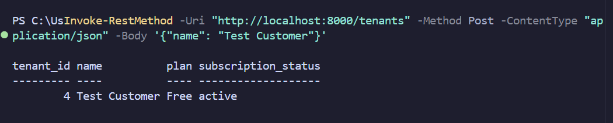
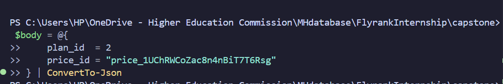
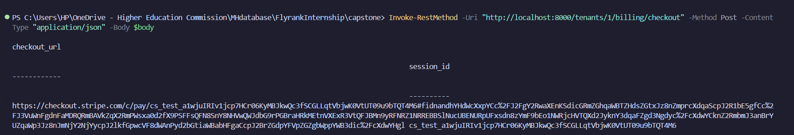
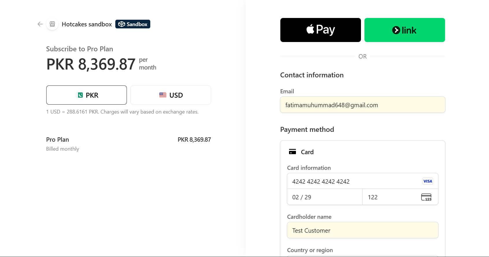

Created a Test customer 

got the current plan status

created a checkout session

The checkout status 

The URL opened in the payement area

Updated to Pro Status

## Idempotency Test on terminal 

First request
Generated specific idempotency-key with the specific tenant
Second request demanded the same, it returned the same id:1, instead of making a new one

# Quota Test

Server Flags it successfully

