# EVIDENCE.md - Usage Metering & Billing Engine

This document provides evidence that all core requirements of the Usage Metering & Billing Engine capstone have been successfully implemented and tested.

---

## Database Setup

### PostgreSQL via Docker

The PostgreSQL database was successfully created and run through Docker Compose.

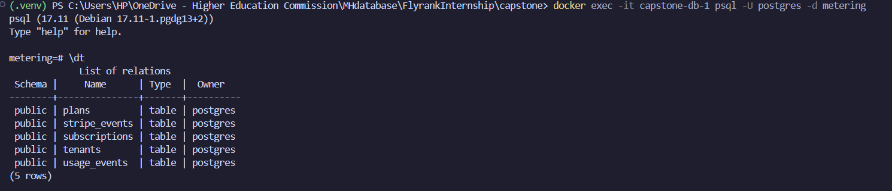

### In-Memory SQLite Testing Database

An isolated in-memory SQLite database was added for automated testing through `tests/conftest.py`.

This allows the test suite to run independently of the development PostgreSQL database.

---

## Stripe Integration

### Stripe CLI Webhook Forwarding

The Stripe CLI was used to forward webhook events to the local FastAPI application.

Start the webhook listener with:

```bash
stripe listen --forward-to http://127.0.0.1:8000/webhooks/stripe
```

Stripe CLI provides a webhook signing secret after the listener starts.

Add the secret to the `.env` file:

```env
STRIPE_WEBHOOK_SECRET=your_webhook_secret
```

Restart the API after changing environment variables.

## Triggering Stripe Test Events

Stripe CLI can also be used to generate test webhook events.

Example:

```bash
stripe trigger checkout.session.completed
```
Webhook Event Flow
When a test event is triggered, the following happens:

1. Stripe CLI creates test fixtures (product, price, payment method, checkout session)

2. Stripe simulates the checkout flow and generates webhook events

3. Events are forwarded to your local FastAPI application

4. Our app verifies the Stripe signature

5. Our app processes the event and updates the database

6.Our app returns 200 OK for each successfully processed event


Other Stripe test events (like subscription.deletion and subscription.updation) can be triggered through the Stripe CLI as required.

The webhook endpoint verifies the Stripe signature before processing any event.


## Stripe Product Store


Created the "Pro Plan" product in Stripe test mode using Stripe CLI. The sandbox environment is called "Hotcakes".


# Stripe Integration Testing


The Stripe integration was tested to verify that a tenant could successfully upgrade from the Free plan to the Pro plan.


## 1. Create a Test Customer


A test customer was created successfully through the API.


## 2. Check the Current Plan


The customer's current subscription status was queried to confirm that the tenant was initially on the Free plan.


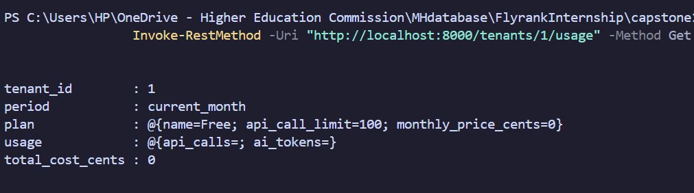


## 3. Create a Stripe Checkout Session


A Stripe Checkout session was created for the Pro plan.


The `price_id` used for the Checkout session was obtained from the Stripe Dashboard after creating the test product in the `hotcakes_sandbox` environment.


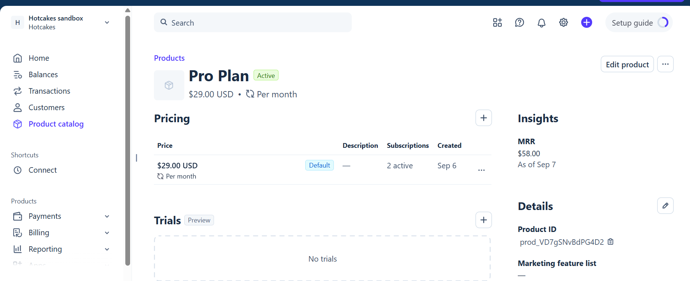


The customer was then queried to verify the associated billing information.


## 4. Open the Checkout Page


The Checkout request successfully returned a Stripe Checkout URL.


## 5. Complete the Stripe Test Payment


The generated URL opened the Stripe payment page for the Pro plan.


Stripe's test card number `4242 4242 4242 4242` was used to simulate a successful payment.


## 6. Verify the Pro Plan Upgrade


After completing the test payment, the customer's subscription status was queried again.


The tenant was successfully updated from the Free plan to the Pro plan.


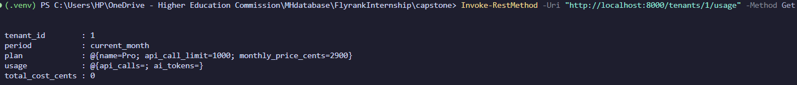


# Idempotency Test


The usage metering idempotency mechanism was tested directly through the terminal.


### First Request


A specific `idempotency_key` was generated for a tenant, and the usage request was submitted successfully.


### Second Request


The same request was submitted again using the same `idempotency_key`.


Instead of creating a new usage event, the API returned the existing event with `id: 1`.

This confirms that duplicate requests are handled idempotently and do not result in duplicate usage records.

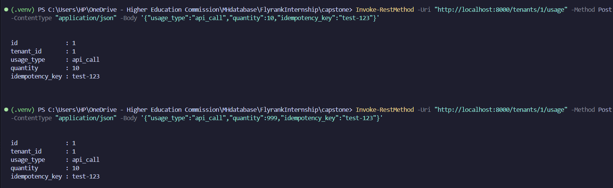

# Quota Enforcement Test

The quota enforcement mechanism was tested by submitting usage that reached and exceeded the configured quota.

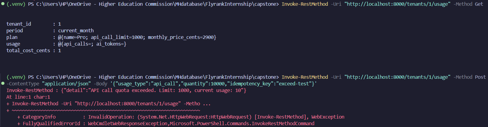

The server successfully detected the quota violation and rejected the request.

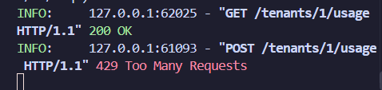

# Background Usage Alert Job

The usage alert functionality is implemented in:

```text
jobs/usage_alerts.py
```

### Purpose

The background job monitors tenant usage and generates alerts when usage reaches the configured thresholds:

* **80%** — Warning
* **100% or more** — Critical

For this demonstration, the alert job was triggered manually through the API.

In a cloud deployment, this job could be scheduled using a service such as GitHub Actions with a cron schedule. A cloud-hosted database would be required for a continuously deployed environment, for example PostgreSQL hosted through a service such as Supabase.

## Quota Warning at 80% Usage

Usage was increased to 80 API calls for tenant `2`, reaching 80% of the configured quota.

The following request was used:

```powershell
Invoke-RestMethod `
    -Uri "http://localhost:8000/tenants/2/usage" `
    -Method Post `
    -ContentType "application/json" `
    -Body '{"usage_type":"api_call","quantity":80,"idempotency_key":"alert-test-80"}'
```

The usage alert job was then triggered manually through the admin endpoint:

```powershell
Invoke-RestMethod -Uri "http://localhost:8000/admin/alerts" -Method Post
```

The system successfully generated the expected **80% usage warning**.

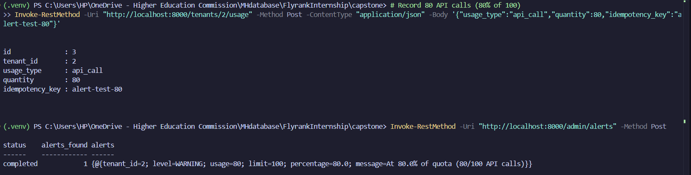

## Critical Alert at 100% Usage

The tenant's usage was then increased by another 10 API calls, bringing total usage to 100% of the quota.

The following request was used:

```powershell
Invoke-RestMethod `
    -Uri "http://localhost:8000/tenants/3/usage" `
    -Method Post `
    -ContentType "application/json" `
    -Body '{"usage_type":"api_call","quantity":10,"idempotency_key":"alert-test-100"}'
```

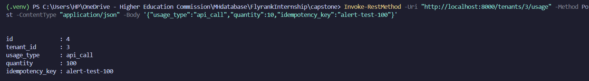

The alert job was triggered again.

The resulting output contained both the previously triggered **80% warning** and the new **100% critical alert**, confirming that the system correctly identifies both usage thresholds.

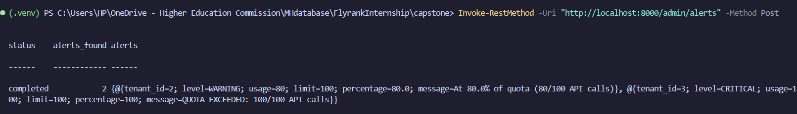

# Automated Tests

The complete automated test suite was executed successfully from the terminal.

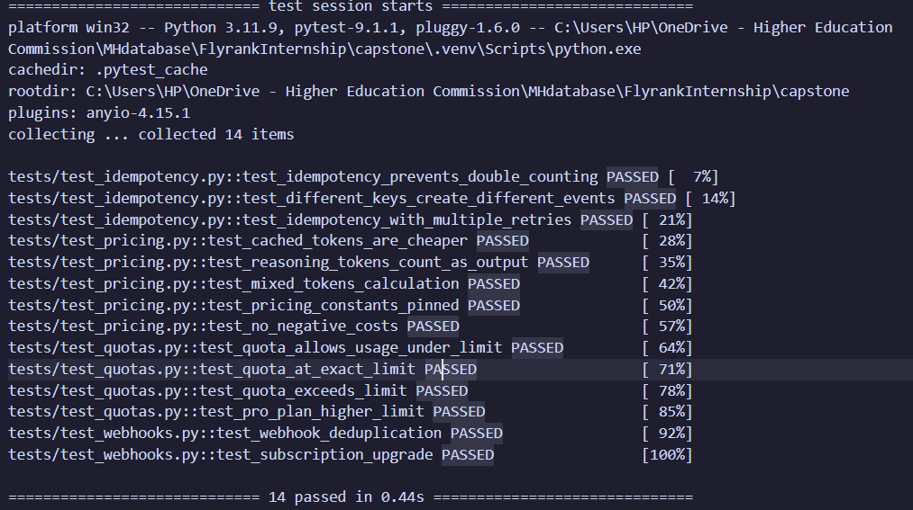

The tests can also be run independently after cloning and configuring the repository with:

```bash
pytest tests/ -v
```

The test suite covers the core functionality of the system, including:

* Usage idempotency
* Quota enforcement
* Pricing calculations
* Stripe webhook handling
* Duplicate webhook protection
* Invalid webhook signature rejection
* Subscription plan updates

All implemented tests completed successfully.


   
