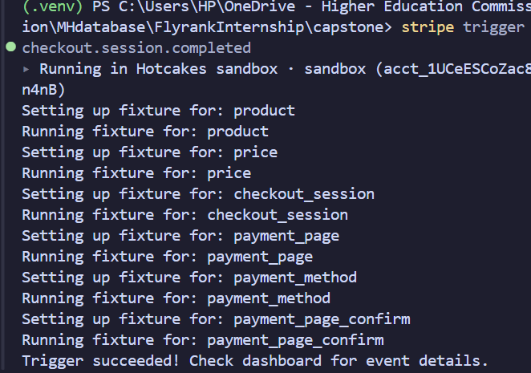

The Stripe CLI can be used to forward webhook events to the local API.

Start the webhook listener:

stripe listen --forward-to http://127.0.0.1:8000/webhooks/stripe

Stripe CLI will provide a webhook signing secret.

Set that secret in .env:

STRIPE_WEBHOOK_SECRET=your_webhook_secret

Restart the API after changing environment variables.

Triggering Stripe Test Events

Stripe CLI can be used to generate test webhook events.

Example:

stripe trigger checkout.session.completed

Other Stripe test events can also be generated through the CLI.

The webhook endpoint verifies the Stripe signature before processing the event.


            


An In-memory SQLite database is added from test in tests/conftest.py

Created a Test customer 


got the current plan status


created a checkout session


The checkout status 


The URL opened in the payement area


Updated to Pro Status


## Idempotency Test on terminal 

First request
Generated specific idempotency-key with the specific tenant
Second request demanded the same, it returned the same id:1, instead of making a new one


# Quota Test


Server Flags it successfully


## BackGround Job: Quota alert added

**Implementation:** `jobs/usage_alerts.py`

**Purpose:** Proactively monitor tenant usage and alert at 80% and 100% of quota.

Manual Triggered, we can host this on cloud by the Github actions cron jobs but that would require cloud based database on enviorments like supabase.

### Quota Warning at 80% Usage

This request caused the id:2's quota to increase
```
Invoke-RestMethod 
    -Uri "http://localhost:8000/tenants/2/usage" `
    -Method Post `
    -ContentType "application/json" `
    -Body '{"usage_type":"api_call","quantity":80,"idempotency_key":"alert-test-80"}'`
```
This Trigger alert was produce when the manual endpoint was called upon

```
Invoke-RestMethod -Uri "http://localhost:8000/admin/alerts" -Method Post

```
The result:


### Quota Critical alert at 100% usage
This user had used 90% of their tokens by adding 10 more token usage
```
    Invoke-RestMethod `
        -Uri "http://localhost:8000/tenants/3/usage" `
        -Method Post `
        -ContentType "application/json" `
        -Body '{"usage_type":"api_call","quantity":10,"idempotency_key":"alert-test-100"}'
```


This warning was issued; two warnings, 

One for the 80% usage warning and one critical usage warning


Output